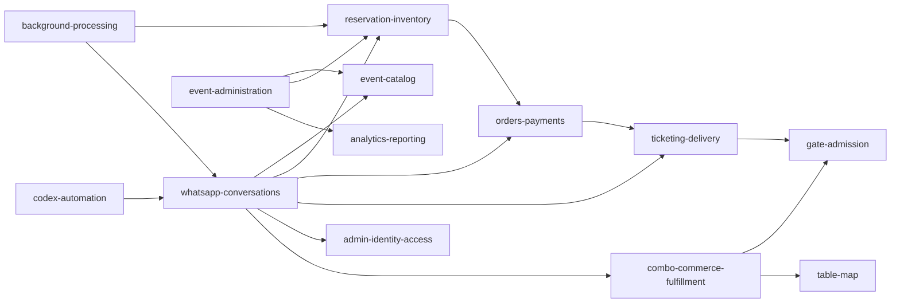

> **Current Baseline 2.8.1 (2026-09-16):** `PATCH_DOCUMENTARY_CORRECTION` on canonical functional source `c48405e41df3d1cd69eb3d383b7c6dd17257155e`. Fingerprint `ef5d175d8edf5c867131ac4e65f80555e0e5839640595b486ee79c9b99885f91`; 394 source files, 88 migrations, 45 tables, 63 SQL functions, 1 sequence, 59 test files and 47 findings. `risk.rate-limit-fails-open` is RESOLVED with explicit outage policy across 19 boundaries. Release blockers: 0; Product and Infrastructure remain DEGRADED.

# Domains reais do Rota5

Baseline arquitetural as-is de 11/09/2026. Foram identificados **17 domains** por agrupamento de responsabilidades, tabelas, entrypoints e chamadas observadas. Os limites se sobrepõem quando um módulo é compartilhado; cada módulo tem um domain primário em `modules.json`.

## Visão geral

| ID canônico | Nome | Propósito observado | Status / confiança |
| --- | --- | --- | --- |
| `domain.platform-runtime` | Runtime e infraestrutura compartilhada | Fornecer ambiente, cliente Supabase, logging, respostas HTTP, rate limit e adapters externos. | CONFIRMADO / ALTA |
| `domain.brand-presentation` | Marca e apresentação | Definir flags de apresentação, shell visual, mensagens e assets de marca. | PARCIALMENTE CONFIRMADO / ALTA |
| `domain.whatsapp-conversations` | Conversas e mensageria WhatsApp | Receber mensagens, manter contexto, classificar intenção, executar diálogo e persistir/envia respostas. | PARCIALMENTE CONFIRMADO / ALTA |
| `domain.customer-risk` | Cliente, telefone e risco do comprador | Identificar cliente pelo WhatsApp e registrar/avaliar sinais de risco em reserva e checkout. | CONFIRMADO / ALTA |
| `domain.event-catalog` | Catálogo e disponibilidade de eventos | Representar locais, eventos, sessões, setores, assentos, preços, busca, visibilidade e disponibilidade pública. | CONFIRMADO / ALTA |
| `domain.event-administration` | Administração de eventos | Listar, criar, editar, duplicar e excluir eventos e seus catálogos associados. | PARCIALMENTE CONFIRMADO / ALTA |
| `domain.reservation-inventory` | Reservas e inventário de sessão | Reservar/liberar capacidade, manter itens congelados e expirar/cancelar reservas. | CONFIRMADO / ALTA |
| `domain.orders-payments` | Pedidos e pagamentos | Criar pedido/checkout Pix, acompanhar pagamento, processar webhook e confirmar compra. | PARCIALMENTE CONFIRMADO / ALTA |
| `domain.ticketing-delivery` | Emissão e entrega de ingressos | Emitir, assinar, renderizar, distribuir, reenviar e consultar ingressos. | PARCIALMENTE CONFIRMADO / ALTA |
| `domain.admin-identity-access` | Identidade e autorização administrativa | Gerir administradores, papéis, permissões, passphrases, tentativas, challenges, sessões WhatsApp e web. | CONFIRMADO / ALTA |
| `domain.gate-admission` | Portaria e controle de acesso | Autorizar operadores, emitir sessões, consultar QR e validar entrada por evento/sessão. | PARCIALMENTE CONFIRMADO / ALTA |
| `domain.courtesy` | Cortesias | Aplicar limites, emitir/cancelar cortesias e emitir ingresso gratuito público. | CONFIRMADO / ALTA |
| `domain.combo-commerce-fulfillment` | Ofertas, venda e entrega de combos | Administrar ofertas, criar/cobrar pedidos, entregar QR, preparar e validar resgate. | PARCIALMENTE CONFIRMADO / ALTA |
| `domain.table-map` | Mapa oficial e lugares | Definir lugares, persistir coordenadas, renderizar disponibilidade e reservar lugar oficial. | PARCIALMENTE CONFIRMADO / ALTA |
| `domain.analytics-reporting` | Relatórios e analytics administrativos | Produzir relatórios, dashboards, contatos, métricas e baixas de divisão. | PARCIALMENTE CONFIRMADO / ALTA |
| `domain.background-processing` | Processamento agendado | Executar expiração/notificação de reservas, finalização de conversas e manutenção de batches. | PARCIALMENTE CONFIRMADO / ALTA |
| `domain.codex-automation` | Automação Codex por WhatsApp | Reconhecer pedidos autorizados, criar issues/listagens e executar Codex CLI local. | PARCIALMENTE CONFIRMADO / MÉDIA |

## Relações principais

As setas representam dependências agregadas comprovadas por chamadas dos módulos. Elas não significam isolamento forte: o router central e os serviços de combo atravessam vários domains.

## `domain.platform-runtime` — Runtime e infraestrutura compartilhada

Fornecer ambiente, cliente Supabase, logging, respostas HTTP, rate limit e adapters externos.

- **Paths:** src/lib; src/proxy.ts
- **Módulos associados:** `platform.env`, `platform.supabase-client`, `platform.logging`, `platform.http`, `platform.rate-limit`, `integration.zapi`, `integration.mercado-pago`, `platform.edge-proxy`
- **Tabelas associadas:** `rate_limit_events`
- **Entrypoints:** `proxy`
- **Integrações:** `integration-supabase`, `integration-zapi`, `integration-mercado-pago`
- **Dependências com outros domains:** Nenhum identificado
- **Evidências:** `src/lib/env.ts`, `src/lib/supabase/admin.ts`, `src/lib/logger.ts`, `src/lib/security/rateLimit.ts`, `src/proxy.ts`
- **Status:** CONFIRMADO
- **Confiança:** ALTA

## `domain.brand-presentation` — Marca e apresentação

Definir flags de apresentação, shell visual, mensagens e assets de marca.

- **Paths:** src/lib/tickets/rota5Presentation.ts; src/app/globals.css; public
- **Módulos associados:** `brand.presentation`, `brand.shell-assets`
- **Tabelas associadas:** Nenhum identificado
- **Entrypoints:** `page-root`
- **Integrações:** Nenhum identificado
- **Dependências com outros domains:** `domain.whatsapp-conversations`, `domain.event-catalog`
- **Evidências:** `ROTA5_PRESENTATION_*`, `public/rota5.webp`, `public/ticket_blackhouse.psd`, `referências RockBar/Black House`
- **Status:** PARCIALMENTE CONFIRMADO
- **Confiança:** ALTA

## `domain.whatsapp-conversations` — Conversas e mensageria WhatsApp

Receber mensagens, manter contexto, classificar intenção, executar diálogo e persistir/envia respostas.

- **Paths:** src/lib/tickets/router.ts; src/app/api/webhook/zapi/route.ts
- **Módulos associados:** `messaging.webhook`, `messaging.router`, `messaging.state`, `messaging.public-dialog`, `messaging.customers`, `messaging.conversations`, `messaging.messages`, `messaging.outbound-deliveries`, `messaging.batches`, `messaging.finalizer`
- **Tabelas associadas:** `conversations`, `customers`, `whatsapp_messages`, `whatsapp_outbound_deliveries`, `whatsapp_message_batches`, `whatsapp_message_batch_messages`
- **Entrypoints:** `http-zapi-webhook`, `http-cron-batches`
- **Integrações:** `integration-zapi`, `integration-supabase`, `integration-github`
- **Dependências com outros domains:** `domain.customer-risk`, `domain.event-catalog`, `domain.reservation-inventory`, `domain.orders-payments`, `domain.ticketing-delivery`, `domain.admin-identity-access`, `domain.gate-admission`, `domain.courtesy`, `domain.combo-commerce-fulfillment`, `domain.analytics-reporting`, `domain.codex-automation`
- **Evidências:** `routeTicketMessage`, `src/app/api/webhook/zapi/route.ts`, `conversationState.ts`, `services/messages.ts`
- **Status:** PARCIALMENTE CONFIRMADO
- **Confiança:** ALTA

## `domain.customer-risk` — Cliente, telefone e risco do comprador

Identificar cliente pelo WhatsApp e registrar/avaliar sinais de risco em reserva e checkout.

- **Paths:** src/lib/tickets/services/customers.ts; src/lib/tickets/services/buyerRisk.ts
- **Módulos associados:** `messaging.customers`, `customer-risk.service`
- **Tabelas associadas:** `customers`, `buyer_risk_events`
- **Entrypoints:** `http-zapi-webhook`, `http-checkout-pay`
- **Integrações:** `integration-supabase`
- **Dependências com outros domains:** `domain.reservation-inventory`, `domain.orders-payments`
- **Evidências:** `getOrCreateCustomer`, `checkReservationRisk`, `checkCheckoutRisk`
- **Status:** CONFIRMADO
- **Confiança:** ALTA

## `domain.event-catalog` — Catálogo e disponibilidade de eventos

Representar locais, eventos, sessões, setores, assentos, preços, busca, visibilidade e disponibilidade pública.

- **Paths:** src/lib/tickets/services/events.ts
- **Módulos associados:** `catalog.events`, `catalog.visibility`, `catalog.inventory-read`
- **Tabelas associadas:** `venues`, `venue_sections`, `seats`, `events`, `event_sessions`, `event_aliases`, `ticket_prices`
- **Entrypoints:** `http-zapi-webhook`
- **Integrações:** `integration-supabase`
- **Dependências com outros domains:** `domain.reservation-inventory`, `domain.brand-presentation`
- **Evidências:** `searchEvents`, `search_public_events_ranked`, `classifyPublicAvailability`, `listAvailableSections`
- **Status:** CONFIRMADO
- **Confiança:** ALTA

## `domain.event-administration` — Administração de eventos

Listar, criar, editar, duplicar e excluir eventos e seus catálogos associados.

- **Paths:** src/app/admin/eventos; src/lib/tickets/services/adminEvents.ts; scripts/import-programacao-events.mjs; scripts/rename-black-house-ticket-sections.mjs; scripts/split-black-house-special-items.mjs; scripts/update-black-house-sectors.mjs
- **Módulos associados:** `event-admin.service`, `event-admin.api`, `event-admin.ui`, `event-admin.program-importer`, `event-admin.black-house-maintenance`
- **Tabelas associadas:** `venues`, `venue_sections`, `seats`, `events`, `event_sessions`, `session_seats`, `ticket_prices`, `reservations`, `reservation_items`, `payments`, `tickets`, `courtesy_section_limits`, `official_table_map_reservations`, `ticket_validation_events`, `whatsapp_messages`, `combo_offers`, `combo_orders`, `combo_redemptions`, `admin_users`
- **Entrypoints:** `page-admin-events`, `http-admin-events`, `http-admin-event-id`, `script-import`, `script-bh-rename`, `script-bh-split`, `script-bh-update`
- **Integrações:** `integration-supabase`
- **Dependências com outros domains:** `domain.admin-identity-access`, `domain.event-catalog`, `domain.reservation-inventory`, `domain.ticketing-delivery`, `domain.courtesy`, `domain.table-map`, `domain.analytics-reporting`, `domain.combo-commerce-fulfillment`
- **Evidências:** `AdminEventsEditor`, `createAdminEvent`, `duplicateAdminEvent`, `/api/admin/events`, `scripts/import-programacao-events.mjs`, `scripts/rename-black-house-ticket-sections.mjs`, `scripts/split-black-house-special-items.mjs`, `scripts/update-black-house-sectors.mjs`
- **Status:** PARCIALMENTE CONFIRMADO
- **Confiança:** ALTA
- **Notas:** O modal de criação não faz parse no commit auditado. O importador usa constantes Black House/Sorocaba/SP e sua execução atual não foi validada.

## `domain.reservation-inventory` — Reservas e inventário de sessão

Reservar/liberar capacidade, manter itens congelados e expirar/cancelar reservas.

- **Paths:** src/lib/tickets/services/reservations.ts
- **Módulos associados:** `reservation.service`, `reservation.expiry`
- **Tabelas associadas:** `session_seats`, `reservations`, `reservation_items`
- **Entrypoints:** `http-zapi-webhook`, `http-cron-expire`
- **Integrações:** `integration-supabase`, `integration-zapi`
- **Dependências com outros domains:** `domain.customer-risk`, `domain.event-catalog`, `domain.orders-payments`, `domain.table-map`
- **Evidências:** `reserveTicketCart`, `cancelPendingReservationForCustomer`, `expireReservationsAndNotify`, `reserve_ticket_cart`, `expire_reservations`
- **Status:** CONFIRMADO
- **Confiança:** ALTA

## `domain.orders-payments` — Pedidos e pagamentos

Criar pedido/checkout Pix, acompanhar pagamento, processar webhook e confirmar compra.

- **Paths:** src/lib/tickets/services/checkout.ts; src/app/api/webhook/payment/mercado-pago/route.ts
- **Módulos associados:** `payment.checkout`, `payment.api-ui`, `payment.webhook`, `payment.primitives`
- **Tabelas associadas:** `orders`, `payments`, `payment_events`
- **Entrypoints:** `page-checkout`, `http-checkout-mp`, `http-checkout-pay`, `http-checkout-status`, `http-mp-webhook`
- **Integrações:** `integration-supabase`, `integration-mercado-pago`
- **Dependências com outros domains:** `domain.customer-risk`, `domain.event-catalog`, `domain.reservation-inventory`, `domain.ticketing-delivery`, `domain.combo-commerce-fulfillment`
- **Evidências:** `createCheckoutForReservation`, `paySelfHostedCheckout`, `confirm_paid_ticket_order`, `payment_events`
- **Status:** PARCIALMENTE CONFIRMADO
- **Confiança:** ALTA

## `domain.ticketing-delivery` — Emissão e entrega de ingressos

Emitir, assinar, renderizar, distribuir, reenviar e consultar ingressos.

- **Paths:** src/lib/tickets/services/tickets.ts; src/lib/tickets/services/ticketDelivery.ts
- **Módulos associados:** `ticket.service`, `ticket.delivery`, `ticket.qr`, `ticket.public-page`, `ticket.free-issuance`, `admin.ticket-operations`
- **Tabelas associadas:** `tickets`, `ticket_validation_events`
- **Entrypoints:** `page-ticket`, `http-zapi-webhook`, `http-mp-webhook`
- **Integrações:** `integration-supabase`, `integration-zapi`
- **Dependências com outros domains:** `domain.event-catalog`, `domain.orders-payments`, `domain.gate-admission`, `domain.table-map`, `domain.combo-commerce-fulfillment`
- **Evidências:** `deliverTicketsForOrder`, `generateTicketQrImage`, `getTicketBySignedToken`, `assign_participant_contacts_to_order_tickets`
- **Status:** PARCIALMENTE CONFIRMADO
- **Confiança:** ALTA

## `domain.admin-identity-access` — Identidade e autorização administrativa

Gerir administradores, papéis, permissões, passphrases, tentativas, challenges, sessões WhatsApp e web.

- **Paths:** src/lib/tickets/services/adminAuth.ts
- **Módulos associados:** `admin.auth`, `admin.users`, `admin.login-ui-api`
- **Tabelas associadas:** `admin_users`, `admin_sessions`, `admin_auth_attempts`, `admin_login_challenges`
- **Entrypoints:** `page-admin-login`, `http-admin-open`, `http-admin-login`
- **Integrações:** `integration-supabase`
- **Dependências com outros domains:** `domain.whatsapp-conversations`
- **Evidências:** `ADMIN_ROLE_PERMISSIONS`, `requireAdminEventEditorSession`, `createAdminSession`, `admin_login_challenges`
- **Status:** CONFIRMADO
- **Confiança:** ALTA

## `domain.gate-admission` — Portaria e controle de acesso

Autorizar operadores, emitir sessões, consultar QR e validar entrada por evento/sessão.

- **Paths:** src/lib/tickets/services/gateSessions.ts; src/app/gate
- **Módulos associados:** `gate.access-session`, `gate.validation`, `gate.ui-api`
- **Tabelas associadas:** `gate_accesses`, `fixed_gate_accesses`, `gate_sessions`
- **Entrypoints:** `page-gate`, `http-gate-consult`, `http-gate-scan`, `http-gate-validate`
- **Integrações:** `integration-supabase`
- **Dependências com outros domains:** `domain.admin-identity-access`, `domain.event-catalog`, `domain.ticketing-delivery`, `domain.combo-commerce-fulfillment`
- **Evidências:** `createGateSession`, `validateGateScan`, `validate_ticket_entry`, `GateSessionScanner`
- **Status:** PARCIALMENTE CONFIRMADO
- **Confiança:** ALTA

## `domain.courtesy` — Cortesias

Aplicar limites, emitir/cancelar cortesias e emitir ingresso gratuito público.

- **Paths:** src/lib/tickets/services/adminCourtesies.ts; src/lib/tickets/services/publicFreeTickets.ts
- **Módulos associados:** `courtesy.service`, `ticket.free-issuance`
- **Tabelas associadas:** `courtesies`, `courtesy_limits`, `courtesy_section_limits`
- **Entrypoints:** `http-zapi-webhook`, `http-admin-event-id`
- **Integrações:** `integration-supabase`, `integration-zapi`
- **Dependências com outros domains:** `domain.admin-identity-access`, `domain.event-catalog`, `domain.reservation-inventory`, `domain.ticketing-delivery`
- **Evidências:** `issueAdminCourtesy`, `issue_admin_courtesy_order`, `issue_public_free_ticket_order`
- **Status:** CONFIRMADO
- **Confiança:** ALTA

## `domain.combo-commerce-fulfillment` — Ofertas, venda e entrega de combos

Administrar ofertas, criar/cobrar pedidos, entregar QR, preparar e validar resgate.

- **Paths:** src/lib/tickets/services/comboOffers.ts; src/lib/tickets/services/comboRedemptions.ts
- **Módulos associados:** `combo.offers`, `combo.checkout-ui-api`, `combo.redemption`, `combo.qr`, `combo.kitchen-reader-ui-api`, `combo.admin-ui`
- **Tabelas associadas:** `combo_offers`, `combo_offer_scopes`, `combo_offer_event_locks`, `combo_orders`, `combo_payments`, `combo_redemptions`, `combo_redemption_events`
- **Entrypoints:** `http-admin-combos`, `http-admin-combo-id`, `page-combo-checkout`, `http-combo-pay`, `http-combo-status`, `page-kitchen-access`, `page-kitchen-session`, `page-offer-reader`, `http-kitchen-open`, `http-kitchen-prepare`, `http-kitchen-scan`, `http-kitchen-validate`
- **Integrações:** `integration-supabase`, `integration-mercado-pago`, `integration-zapi`
- **Dependências com outros domains:** `domain.customer-risk`, `domain.event-catalog`, `domain.orders-payments`, `domain.ticketing-delivery`, `domain.gate-admission`, `domain.table-map`, `domain.whatsapp-conversations`
- **Evidências:** `createComboOffer`, `payComboCheckout`, `deliverComboOrder`, `validateComboRedemptionScan`, `validate_combo_redemption`
- **Status:** PARCIALMENTE CONFIRMADO
- **Confiança:** ALTA

## `domain.table-map` — Mapa oficial e lugares

Definir lugares, persistir coordenadas, renderizar disponibilidade e reservar lugar oficial.

- **Paths:** src/lib/tickets/tableMap; src/lib/tickets/services/officialTableMapReservations.ts
- **Módulos associados:** `table-map.catalog-render`, `table-map.reservation`, `table-map.admin-ui-api`
- **Tabelas associadas:** `official_table_map_places`, `official_table_map_reservations`, `seat_map_renders`
- **Entrypoints:** `http-admin-map`
- **Integrações:** `integration-supabase`
- **Dependências com outros domains:** `domain.event-catalog`, `domain.reservation-inventory`, `domain.orders-payments`, `domain.ticketing-delivery`
- **Evidências:** `OFFICIAL_TABLE_MAP_PLACES`, `persistOfficialTableMapPlaces`, `renderOfficialTableMap`, `reserve_official_table_map_place`
- **Status:** PARCIALMENTE CONFIRMADO
- **Confiança:** ALTA
- **Notas:** seat_map_renders não tem consumidor encontrado.

## `domain.analytics-reporting` — Relatórios e analytics administrativos

Produzir relatórios, dashboards, contatos, métricas e baixas de divisão.

- **Paths:** src/lib/tickets/services/adminReports.ts; src/app/admin/operacao
- **Módulos associados:** `analytics.reports`, `analytics.contacts`, `analytics.operational-dashboard`, `analytics.admin-dashboard-ui`
- **Tabelas associadas:** `division_settlements`
- **Entrypoints:** `page-admin-ops`, `http-admin-ops`, `page-admin-events`, `http-admin-events`, `http-admin-event-id`
- **Integrações:** `integration-supabase`
- **Dependências com outros domains:** `domain.admin-identity-access`, `domain.event-catalog`, `domain.reservation-inventory`, `domain.orders-payments`, `domain.ticketing-delivery`, `domain.gate-admission`, `domain.courtesy`, `domain.combo-commerce-fulfillment`, `domain.whatsapp-conversations`
- **Evidências:** `buildAdminReport`, `getAdminContactActivity`, `get_admin_intelligence_dashboard`, `get_admin_general_dashboard_summary`
- **Status:** PARCIALMENTE CONFIRMADO
- **Confiança:** ALTA

## `domain.background-processing` — Processamento agendado

Executar expiração/notificação de reservas, finalização de conversas e manutenção de batches.

- **Paths:** src/app/api/cron; vercel.json
- **Módulos associados:** `background.expire-cron`, `background.batch-cron`, `reservation.expiry`, `messaging.finalizer`, `messaging.batches`
- **Tabelas associadas:** Nenhum identificado
- **Entrypoints:** `http-cron-expire`, `http-cron-batches`, `trigger-cron-expire`, `trigger-cron-batches`
- **Integrações:** `integration-vercel`, `integration-supabase`, `integration-zapi`
- **Dependências com outros domains:** `domain.reservation-inventory`, `domain.whatsapp-conversations`
- **Evidências:** `vercel.json`, `expireReservationsAndNotify`, `processDueWhatsAppMessageBatches`, `finalizeInactiveWhatsAppConversations`
- **Status:** PARCIALMENTE CONFIRMADO
- **Confiança:** ALTA

## `domain.codex-automation` — Automação Codex por WhatsApp

Reconhecer pedidos autorizados, criar issues/listagens e executar Codex CLI local.

- **Paths:** src/lib/tickets/codexRequests.ts; scripts/codex-local-runner.mjs
- **Módulos associados:** `automation.github-issues`, `automation.codex-requests`, `automation.local-runner`
- **Tabelas associadas:** `whatsapp_messages`
- **Entrypoints:** `http-zapi-webhook`, `npm-codex-requests`, `npm-codex-runner`, `script-codex-runner`, `script-codex-list`
- **Integrações:** `integration-supabase`, `integration-zapi`, `integration-github`, `integration-codex-cli`
- **Dependências com outros domains:** `domain.whatsapp-conversations`, `domain.admin-identity-access`
- **Evidências:** `createGitHubIssue`, `isCodexRequest`, `scripts/codex-local-runner.mjs`
- **Status:** PARCIALMENTE CONFIRMADO
- **Confiança:** MÉDIA

## Observações de fronteira

- `domain.event-administration` opera sobre tabelas compartilhadas de catálogo, reservas, ingressos, combos, cortesias e analytics; o importador e os scripts Black House também consultam o Supabase diretamente.
- `domain.whatsapp-conversations` inclui o entrypoint e o router que alcançam quase todos os domains de negócio.
- `domain.combo-commerce-fulfillment` reúne venda e operação porque `comboOffers.ts` e `comboRedemptions.ts` cruzam pagamento, mensagem, gate e mapa.
- `domain.brand-presentation` é transversal e não tem seleção runtime de tenant encontrada.
- `domain.background-processing` reutiliza módulos dos domains de reserva e mensageria em vez de manter persistência própria.
